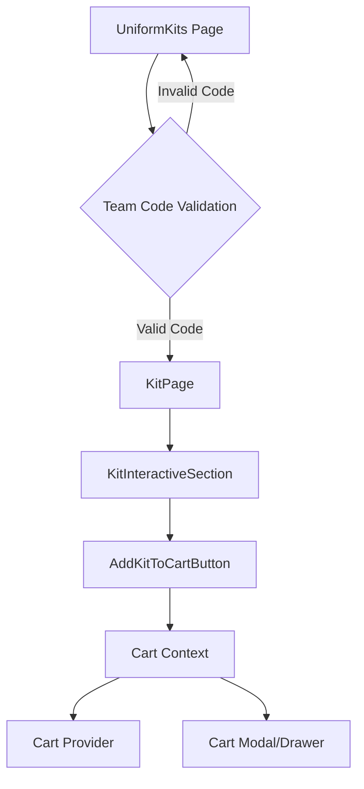

## Uniform Kit Customization Implementation

This document outlines the current state of the uniform kit customization functionality, the improvements made so far, and the remaining work to be implemented.

### Current Implementation

The current implementation consists of the following key components:

1. **UniformKits Page (`app/shop/uniform-kits/page.tsx`):**

   - This page handles the initial team code validation flow.
   - It sends a POST request to the `/api/team-validation` route to validate the entered team code.
   - Upon successful validation, the user is redirected to the `KitPage` component.

2. **KitPage (`app/shop/uniform-kits/team/[teamId]/page.tsx`):**

   - This page fetches the kit details, team information, and player data.
   - It then renders the `KitInteractiveSection` component, passing the necessary data.

3. **KitInteractiveSection (`components/shop/uniform-kits/kit-interaction.tsx`):**

   - This component handles the user interaction with the kit customization, including:
     - Displaying the main kit image
     - Allowing the user to select the player and kit color
     - Displaying the individual kit components (jersey, shorts, socks) and their size selection
   - It maintains the state for the current image, selected player, selected color, and selected sizes.
   - It also renders the `AddKitToCartButton` component, passing the necessary state.

4. **AddKitToCartButton (`components/shop/uniform-kits/kit-interaction.tsx`):**

   - This component is responsible for creating the `KitCartItem` object and adding it to the cart context.
   - It uses the data from the `KitInteractiveSection` component to construct the `KitCartItem`.
   - It then calls the `addKitItem` function from the cart context to add the kit to the cart.

5. **Cart Context (`components/cart/cart-context.tsx` and `components/cart/cart-provider.tsx`):**
   - The cart context provides the necessary functionality to manage the cart items, including:
     - Adding product items and kit items to the cart
     - Removing items from the cart
     - Updating item quantities
     - Clearing the cart
     - Calculating the total number of items and the total price

### Improvements Made

1. **Zod-based Validation:**

   - We've introduced Zod, a TypeScript-first schema validation library, to ensure the integrity of the `KitCartItem` data.
   - This helps catch and handle validation errors, such as missing required fields or invalid values, before adding the item to the cart.

2. **Improved ID Generation:**

   - We've implemented a `generateKitId` function to create a unique identifier for each kit item in the cart.
   - This function combines all relevant kit properties (e.g., product IDs, sizes, player, team) into a unique string, which is then hashed to generate a numeric ID.
   - This ensures that each kit item has a unique identifier, even if the individual components are the same.

3. **Performance Optimizations:**

   - We've memoized expensive calculations, such as the total number of items and the total price, using `useMemo`.
   - We've also memoized callback functions, such as `addKitItem`, using `useCallback` to prevent unnecessary re-renders.

4. **Error Handling and User Feedback:**
   - We've introduced a custom `CartOperationError` class to handle different types of errors that can occur during cart operations.
   - We've added error handling logic to the `addKitItem` function, providing appropriate error messages to the user via a toast notification.

### Remaining Work

1. **Persistence Strategy:**

   - Currently, the cart items are stored in the browser's localStorage. We need to evaluate alternative persistence strategies, such as using a server-side session or a dedicated shopping cart service.
   - This will allow for cart synchronization across tabs and devices, and provide a more robust solution for managing the cart state.

2. **Cart Item Validation before Checkout:**

   - In addition to the validation performed when adding items to the cart, we should also validate the cart contents before allowing the user to proceed to checkout.
   - This could include checks for inventory availability, price changes, and other business-specific rules.

3. **Price Calculations and Discounts:**

   - The current implementation assumes a static price for each kit. We should introduce the ability to apply discounts, bundle pricing, or other price modifiers.
   - This may require integrating with the WooCommerce API to fetch the most up-to-date pricing information.

4. **Animation and Transition States:**
   - To improve the user experience, we should introduce animations and smooth transitions when updating the cart, such as when adding or removing items.
   - This could include visual cues, such as a mini-cart dropdown or a modal overlay, to provide better feedback to the user.

### Flow Diagram

Here's a diagram that illustrates the flow of the uniform kit customization functionality:

1. The user navigates to the `UniformKits` page and enters a team code.
2. The team code is validated using the `/api/team-validation` route.
3. If the code is valid, the user is redirected to the `KitPage`.
4. The `KitPage` component fetches the kit details, team information, and player data, and renders the `KitInteractiveSection`.
5. The `KitInteractiveSection` component handles the user's kit customization, including size selection and color choice.
6. When the user clicks the "Add to Cart" button, the `AddKitToCartButton` component is responsible for creating the `KitCartItem` and adding it to the cart context.
7. The cart context, managed by the `CartProvider`, handles the addition, removal, and update of cart items, as well as providing the total price and item count.
8. The cart state is displayed to the user, either in a modal or a drawer component.

This flow diagram provides an overview of how the different components and files work together to implement the uniform kit customization functionality.

As you can see, it is mainly a form that, upon submission of a team code from the user, sends a post request to the route handler in the /api/team-validation route. This route handles validation of the team code using a supabase client, if it is successful in validating, then they are rereouted to the dynamic app/shop/uniform-kits/team/[teamId] route. The page.tsx file in this route has the following:

[INSERT CODE HERE]

This KitPage component obtains and stores the kit data in the kitInfo variable through the getWooProductById server action. It stores more specific info in other variables (kitName, kitPrice, and kitImages) to send to the KitInteractiveSection component. Additionally, the products of the kit itself are also fetched from a server action function getWooProductsById, so that we can render their image, name, and list of available sizes in the KitInteractiveSection as you will see soon. Finally, team and player info are fetched from supabase (along with a success variable to handle errors). Let's take a look at KitInteractiveSection now.
[INSERT CODE HERE]

This component handles some basic ui but more importantly, some state management on the client side, namely the currentImage variable (which is useful for displaying the main product picture), the selectedProducts variable (which sets the size chosen by a user to the corresponding product with product.id) the selectedPlayer variables manages which player is selected, and the selectedColor variable handles which color the user is selecting. These state variables are sent to the AddKitToCartButton component to handle adding the kit to the cart context I've created. Before I continue with the explanation of this component, the structure of the cart context, and the methods in the cart context provider, how is everything looking so far?
